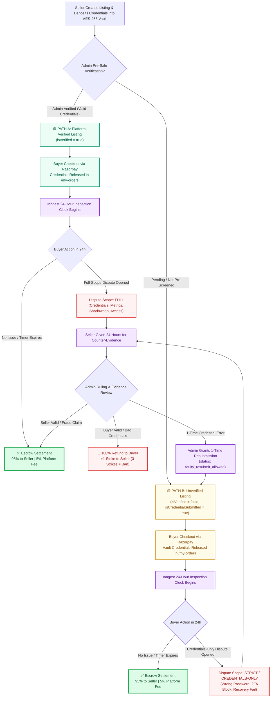

# 🛡️ Socialy - Zero-Trust Escrow Marketplace for Digital Assets & Social Media Accounts

[](https://socialy-beige.vercel.app)
[](http://13.204.83.17:3000)
[](http://13.204.83.17:8288)
[](https://nodejs.org)
[](https://react.dev)
[](https://tailwindcss.com)
[](https://www.docker.com)
[-336791?style=for-the-badge&logo=postgresql)](https://neon.tech)
[](https://redis.io)
[](https://playwright.dev)

> **Socialy** is a full-stack, enterprise-grade escrow marketplace engineered for safely buying and selling social media accounts, digital assets, and online channels. Built with **Zero-Trust AES-256-GCM Vault Encryption**, **ScamShield AI heuristic protection**, **Inngest durable background workflows**, and an **irreversible dual-path dispute resolution engine**.

---

## 🌐 Live Deployments

- **Frontend Application**: [https://socialy-beige.vercel.app](https://socialy-beige.vercel.app) (Vercel Edge Network)
- **Backend API & WebSockets**: [http://13.204.83.17:3000](http://13.204.83.17:3000) (AWS EC2 Mumbai `ap-south-1`)
- **Inngest Workflow Engine**: [http://13.204.83.17:8288](http://13.204.83.17:8288)

---

## 🌟 Key Features

### 1. 🔒 Zero-Trust Credential Vault (AES-256-GCM)
- Account passwords, 2FA backup codes, and recovery emails are encrypted at rest with AES-256-GCM before ever touching the database.
- Credentials remain completely sealed until a buyer completes Razorpay escrow payment.
- Decryption is protected by authenticated encryption (AuthTag verification against tampering).

### 2. ⚖️ Irreversible Escrow State Machine
- **Pre-Sale Verification**: Sellers submit account details for admin verification before buyer checkout is unlocked.
- **24-Hour Inspection Window**: When an account is purchased, a persistent 24-hour inspection clock begins. If no dispute is raised, funds auto-release (95% to seller wallet, 5% platform fee).
- **Dispute Resolution & Evidence Counter**: Buyers can open disputes with video/image proof. Sellers receive a 24-hour deadline to upload counter-evidence before automatic refund forfeit.
- **Admin Mediation**: Dedicated Admin Portal with dispute override, strike penalties (+1 strike, 3 strikes = permanent account ban), and 1-time credential resubmission permissions (`faulty_resubmit_allowed`).

### 3. 🛡️ ScamShield AI & Real-Time Chat Security
- Built-in heuristic rule engine and Google Gemini AI analyzing chat messages for scam patterns, off-platform payment attempts, external links, and fraud signals.
- Integrated WebSocket chat between buyers and sellers with live notification alerts.

### 4. ⚡ Durable Background Workflows (Inngest)
- Long-running 24-hour escrow inspection timers and dispute deadlines run as persistent, decoupled Inngest steps (`step.sleep("24h")`) that survive server restarts and traffic spikes.

### 5. 🚀 High-Performance Caching & Connection Pooling
- **Redis 7**: Caches high-traffic marketplace listings, rate limits authentication and chat spam, and speeds up read queries to `< 10ms`.
- **Neon Serverless PostgreSQL (PgBouncer)**: Handles up to 10,000 pooled connections for seamless multi-user concurrency.

---

## 🔄 Dual-Path Escrow Lifecycle (Verified vs. Unverified)

Socialy implements a strict dual-path escrow lifecycle based on whether the listing underwent pre-sale administrative verification:



### 📊 Comparison: Platform-Verified vs. Unverified Escrow

| Dimension | 🟢 Platform-Verified (`isVerified: true`) | 🟡 Unverified (`isVerified: false`) |
|---|---|---|
| **Pre-Sale Status** | Pre-tested and validated by Socialy Admin | Directly listed after credential vault deposit |
| **Trust Badge** | 🛡️ Verified Platform Badge displayed | 🔒 Escrow Ready (Vault Secured) |
| **Buyer Protection** | 100% Escrow Fund Protection | 100% Escrow Fund Protection |
| **Inspection Window** | 24 Hours (Inngest Durable Workflow) | 24 Hours (Inngest Durable Workflow) |
| **Dispute Scope** | **Full Scope**: Credentials, follower analytics, shadowban checks, audience demographic accuracy | **Strict / Credentials-Only**: Invalid login credentials, 2FA lockout, recovery email failure |
| **Settlement Distribution** | 95% Seller Wallet / 5% Platform Fee | 95% Seller Wallet / 5% Platform Fee |

---

## 🏗️ System Architecture

```text
                                  User / Client
                                       │
                      ┌────────────────┴────────────────┐
                      ▼                                 ▼
        [ Vercel Edge CDN ($0) ]            [ AWS EC2 Linux Server ($0) ]
        • React 18 + Vite SPA               • Node.js Express REST API (Port 3000)
        • Tailwind CSS + Lucide Icons       • WebSocket Real-time Chat
        • Instant Global Page Loads         • AES-256-GCM Vault Manager
        • Free SSL / HTTPS (Vercel)         • Razorpay Payment Webhook Engine
                                                        │
                      ┌─────────────────────────────────┼─────────────────────────────────┐
                      ▼                                 ▼                                 ▼
           [ Redis 7 Container ]             [ Inngest Engine ]             [ Neon Cloud Postgres ]
           • Marketplace Query Cache         • 24h Escrow Countdown         • Prisma ORM
           • Rate Limiting                   • 24h Dispute Deadline         • Connection Pooling
           • Socket Session State            • Resilient Event Queues       • Full Audit Logs
```

---

## 📁 Repository Structure

```text
socialy/
├── client/                     # Frontend React + Vite SPA
│   ├── src/
│   │   ├── components/         # Navbar, Chatbox, Hero, ScamShield AI Copilot
│   │   ├── pages/              # Marketplace, ListingDetails, MyOrders, MyListings
│   │   │   └── admin/          # Admin Dashboard, Verify, Disputes, Transactions
│   │   ├── services/           # Axios API client, Socket.io, Razorpay loader
│   │   └── App.jsx             # React Router routing table
│   ├── Dockerfile              # Production Multi-Stage Nginx Container
│   └── nginx.conf              # SPA Fallback & Security Headers
│
├── server/                     # Backend Node.js Express REST API
│   ├── config/                 # Redis, Clerk, ImageKit, Gemini, Prisma configs
│   ├── Controllers/            # Listing, Admin, Payment, AI, Chat controllers
│   ├── Middlewares/            # Auth, Rate Limiter, ScamShield, Sanitizer
│   ├── prisma/                 # PostgreSQL schema and migrations
│   ├── Routes/                 # Express API route handlers
│   ├── src/inngest/            # Inngest durable workflows (24h Escrow Timers)
│   ├── utils/                  # AES-256 Encryption, ScamShield heuristics, Audit logger
│   └── server.js               # Entry point and WebSocket listener
│
├── tests/                      # Automated QA & E2E Testing Suite
│   ├── e2e/                    # Playwright test specs (Checkout, Escrow, Admin)
│   └── qa-audit.mjs            # 10-Scenario Automated Escrow State Auditor
│
├── docker-compose.yml          # Production Container Orchestration
└── .env.production.example     # Environment variable blueprint
```

---

## 🚀 Getting Started (Local Development)

### Prerequisites
- **Node.js**: `v20+` or `v22+`
- **Docker & Docker Compose** (Optional for local container testing)
- **Git**

### 1. Clone the repository
```bash
git clone https://github.com/sayand-babu/socialy.git
cd socialy
```

### 2. Setup Server Environment
```bash
cd server
npm install
cp .env.example .env # Fill in Neon DB URL, Clerk, Razorpay, and AES Key
npx prisma generate
npm run dev # Starts server on http://localhost:3000
```

### 3. Setup Client Environment
```bash
cd ../client
npm install
cp .env.example .env # Fill in VITE_BASE_URL=http://localhost:3000
npm run dev # Starts frontend on http://localhost:5173
```

---

## 🐳 Docker Deployment (Full-Stack or Backend-Only)

### Launch everything in Docker:
```bash
# 1. Create .env from template
cp .env.production.example .env

# 2. Build and launch containers in background
docker compose up --build -d

# 3. Synchronize database schema
docker compose exec server npx prisma db push
```

---

## 🧪 Automated Testing & Verification

Socialy includes a comprehensive end-to-end test suite powered by **Playwright** and custom QA verification scripts:

```bash
# Run 16/16 Playwright E2E Escrow Tests
npx playwright test

# Run 10/10 Automated Escrow State Machine Audit
node tests/qa-audit.mjs
```

### Verified Test Coverage:
- ✅ Buyer Checkout & Escrow Locking
- ✅ Zero-Trust AES-256 Vault Decryption
- ✅ 24-Hour Inspection Window Countdown
- ✅ Pre-Sale Admin Credential Verification
- ✅ 1-Time Seller Credential Resubmission Flow
- ✅ Dispute Evidence Upload & Admin Mediation
- ✅ 100% Refund & Strike Penalty System

---

## 🛡️ Security & Compliance
- **Zero Hardcoded Secrets**: All credentials passed via environment variables.
- **SQL Injection Immune**: Prepared statements and parameterized queries via Prisma ORM.
- **XSS & CSRF Protected**: Input sanitization middleware, Helmet headers, and CORS whitelisting.
- **Strict Rate Limiting**: Redis token-bucket rate limiters on authentication, upload, and payment endpoints.

---

## 📄 License
This project is licensed under the MIT License - see the [LICENSE](LICENSE) file for details.
